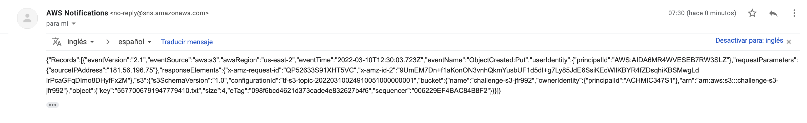
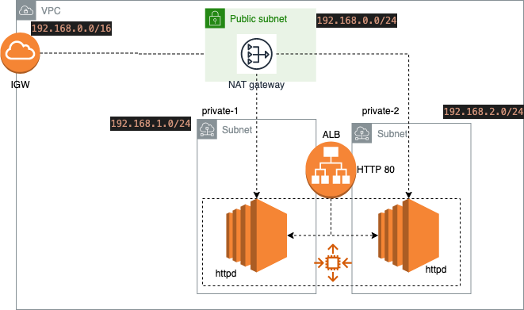
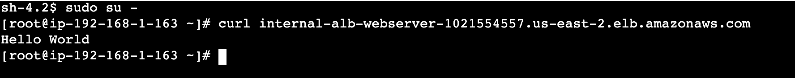
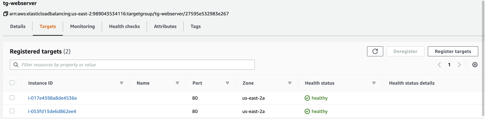
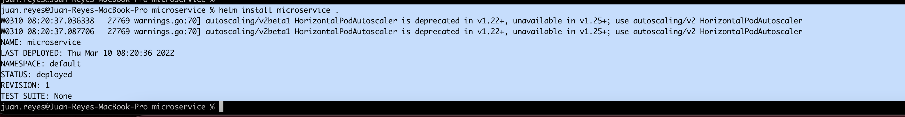
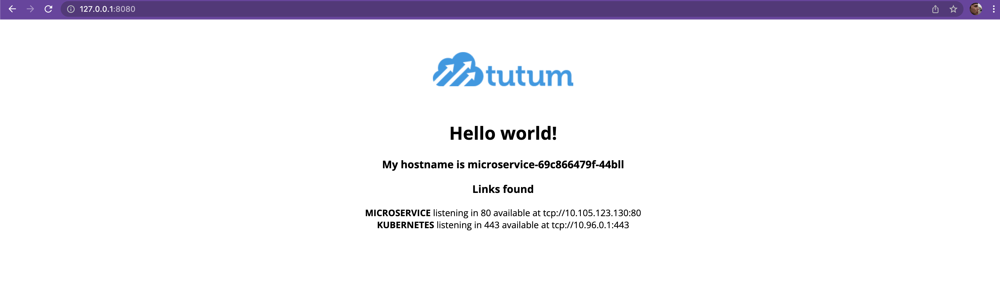

## Terraform ec2 app with terragrunt (WIP)

## Description
A quick guide to setup this terraform project and how to run terratest tests

### Dependencies

terraform >= 1.0.9
go 1.17
helm

### Step by step

* Log-ing to aws console and create an IAM user with enough priviledges.
* Gather the AWS_ACCESS_KEY_ID and AWS_SECRET_ACCESS_KEY and set them as env variables 
```
export AWS_ACCESS_KEY_ID="<AWS_ACCESS_KEY_ID>"
export AWS_SECRET_ACCESS_KEY="<AWS_SECRET_ACCESS_KEY>"
```
* Create the s3 remote state bucket to store the state (it creates a dynamo db table to manage locks). Run the following commands in the s3-tfstate directory
```
terraform init
terraform plan --var-file=s3.tfvars
terraform apply --var-file=s3.tfvars
```
* Once the s3 for the terraform state gets fully created, now the vpc,ec2,igw,security-groups,asg,alb(for the webserver) or the s3 with sns-notification can be created
```
in the s3-sns directory
terraform init
terraform plan --var-file=s3.tfvars
terraform apply --var-file=s3.tfvars

in the vpc-ec2 directory
terraform init
terraform plan --var-file=vpc-ec2.tfvars
terraform apply --var-file=vpc-ec2.tfvars
```
* To run the unit-test developed using terratest run the following commands in the s3-sns/tests directory:

```
go mod init  github.com/user/repo
go mod tidy -compat=1.1
go test -v -run TestTerraformAwsS3 -timeout 30m

Example output:
=== RUN   TestTerraformAwsS3
=== PAUSE TestTerraformAwsS3
=== CONT  TestTerraformAwsS3
TestTerraformAwsS3 2022-03-10T07:29:52-05:00 retry.go:91: terraform [init -upgrade=false]
TestTerraformAwsS3 2022-03-10T07:29:52-05:00 logger.go:66: Running command terraform with args [init -upgrade=false]
TestTerraformAwsS3 2022-03-10T07:29:54-05:00 logger.go:66: 
TestTerraformAwsS3 2022-03-10T07:29:54-05:00 logger.go:66: Initializing the backend...
TestTerraformAwsS3 2022-03-10T07:29:57-05:00 logger.go:66: 
TestTerraformAwsS3 2022-03-10T07:29:57-05:00 logger.go:66: Initializing provider plugins...
TestTerraformAwsS3 2022-03-10T07:29:57-05:00 logger.go:66: - Reusing previous version of hashicorp/aws from the dependency lock file
TestTerraformAwsS3 2022-03-10T07:29:58-05:00 logger.go:66: - Using previously-installed hashicorp/aws v3.74.3
TestTerraformAwsS3 2022-03-10T07:29:58-05:00 logger.go:66: 
TestTerraformAwsS3 2022-03-10T07:29:58-05:00 logger.go:66: Terraform has been successfully initialized!
TestTerraformAwsS3 2022-03-10T07:29:58-05:00 logger.go:66: 
TestTerraformAwsS3 2022-03-10T07:29:58-05:00 logger.go:66: You may now begin working with Terraform. Try running "terraform plan" to see
TestTerraformAwsS3 2022-03-10T07:29:58-05:00 logger.go:66: any changes that are required for your infrastructure. All Terraform commands
TestTerraformAwsS3 2022-03-10T07:29:58-05:00 logger.go:66: should now work.
TestTerraformAwsS3 2022-03-10T07:29:58-05:00 logger.go:66: 
TestTerraformAwsS3 2022-03-10T07:29:58-05:00 logger.go:66: If you ever set or change modules or backend configuration for Terraform,
TestTerraformAwsS3 2022-03-10T07:29:58-05:00 logger.go:66: rerun this command to reinitialize your working directory. If you forget, other
TestTerraformAwsS3 2022-03-10T07:29:58-05:00 logger.go:66: commands will detect it and remind you to do so if necessary.
TestTerraformAwsS3 2022-03-10T07:29:58-05:00 retry.go:91: terraform [output -no-color -json s3-id]
TestTerraformAwsS3 2022-03-10T07:29:58-05:00 logger.go:66: Running command terraform with args [output -no-color -json s3-id]
TestTerraformAwsS3 2022-03-10T07:30:02-05:00 logger.go:66: "challenge-s3-jfr992"
--- PASS: TestTerraformAwsS3 (10.87s)
PASS
ok      github.com/jfr992/sre-coding-challenge  12.037s

```

Basically what this unit test does is checking if the s3-id output is equals as the bucket-name, check if the bucket exists and uploads a random *.txt file to test the sns-s3-bucket-notification:




### Architecture of webServer deployment:



### Additional evidence:

Using session manager to connect to one of the instances and with the curl command to the ALB DNS (AWS) port 80, it can be noticed a http 200 code (ok)



Healthy targets of the alb target group:



### Helm Microservice

To install the hello-world web app using helm, in the microservice directory:

```
helm dep up .
helm install microservice .
```


List the application: check the chart version and app version defined in the Chart.yaml file

```
helm list

juan.reyes@Juan-Reyes-MacBook-Pro microservice % helm list
NAME        	NAMESPACE	REVISION	UPDATED                            	STATUS  	CHART             	APP VERSION
microservice	default  	1       	2022-03-10 08:20:36.81221 -0500 -05	deployed	microservice-0.1.0	1.0.0
juan.reyes@Juan-Reyes-MacBook-Pro microservice %

```

check that everything defined in the values file is correct:

deployment,sa,hpa,pods

```
kubectl get deploy

juan.reyes@Juan-Reyes-MacBook-Pro microservice % kubectl get  deploy
NAME           READY   UP-TO-DATE   AVAILABLE   AGE
microservice   1/1     1            1           2m43s
juan.reyes@Juan-Reyes-MacBook-Pro microservice %

kubectl get sa

juan.reyes@Juan-Reyes-MacBook-Pro microservice % kubectl get  sa
NAME           SECRETS   AGE
default        1         33m
microservice   1         3m15s
juan.reyes@Juan-Reyes-MacBook-Pro microservice %

kubectl get hpa ---> it needs metric server installed in your cluster to work properly

juan.reyes@Juan-Reyes-MacBook-Pro microservice % kubectl get hpa
NAME           REFERENCE                 TARGETS         MINPODS   MAXPODS   REPLICAS   AGE
microservice   Deployment/microservice   <unknown>/80%   1         2         1          3m33s
juan.reyes@Juan-Reyes-MacBook-Pro microservice %


kubectl get pods


juan.reyes@Juan-Reyes-MacBook-Pro microservice % kubectl get pods
NAME                            READY   STATUS    RESTARTS   AGE
microservice-69c866479f-44bll   1/1     Running   0          4m15s
juan.reyes@Juan-Reyes-MacBook-Pro microservice %


Run the following command if you want to check the hello-world page:

 k port-forward <pod-name> 8080:80

```



## Author

Juan Felipe Reyes Marlés  